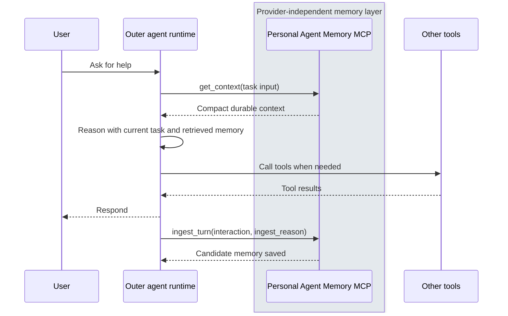

[Chinese README](README.zh.md)

# Personal Agent Memory MCP

Personal Agent Memory MCP is a provider-independent memory layer for AI
assistants. It gives different agents and model providers a shared place to
read and write persistent context.

It is not meant to run the full agent loop, make general tool-use decisions, or
replace the short-term conversation state managed by an outer runtime such as
Codex, Claude Desktop, Dify, Gemini, ChatGPT, or another agent host.

The project focuses on one boundary: long-term personal memory that lives
outside any single model provider.

## Why I Am Building This

I do not want my assistant memory to be locked inside a single model provider.

In practice, I use different assistants in different contexts: sometimes
ChatGPT, sometimes Claude, sometimes Gemini, and potentially other local or
hosted agents later. Each of those tools has its own context and memory system,
but those memories are disconnected from one another.

The goal of this project is to build a provider-independent memory layer: an
overall assistant brain that can hold persistent context outside any single
model provider, and let different AI agents read from and write to the same
durable memory.

MCP, PostgreSQL, pgvector, embeddings, tags, links, and graph expansion are
implementation choices for that goal. They are not the goal themselves.

## How Agents Use It

This project is designed as a memory sidecar for AI agents.

An outer agent runtime stays responsible for the actual conversation, reasoning,
tool use, and response generation. This memory server only answers two
questions:

1. What durable context should the agent know before working on this task?
2. What part of this interaction is worth saving after the task is done?



This keeps memory outside the model provider while still making it available to
any assistant runtime that can speak the supported interface.

## Entry Points

The main agent-facing entry point is MCP.

- `get_context`: read relevant durable memory for the current task.
- `ingest_turn`: write candidate memory from an interaction, with an explicit
  `metadata.ingest_reason`.

There is also a small REST user API for user management, but it is not the
primary interface for agent memory.

Planned maintenance entry points include:

- reviewing candidate notes;
- creating daily diary entries;
- updating profile-derived memory;
- normalizing tags;
- repairing and updating links;
- archiving stale or superseded memory.

## Design Principles

- Memory should be provider-independent, not owned by ChatGPT, Claude, Gemini,
  or any single model vendor.
- Recent chat and durable memory are different things. The outer runtime owns
  short-term conversation state; this project owns long-term memory.
- Memory should be explicit. The caller must provide an `ingest_reason` instead
  of letting every interaction silently become permanent memory.
- Memory should be inspectable and maintainable. Notes, diary entries, profile
  memory, tags, links, and lifecycle events should remain understandable outside
  any one agent session.
- Retrieval should return bounded context, not perform reasoning on behalf of
  the agent.
- Implementation details should be replaceable as long as the memory contract
  remains stable.

## Quick Start

Pending. The local development flow is still being shaped.

The expected flow will be:

1. Install Python dependencies with `uv`.
2. Copy `.env.example` to `.env`.
3. Copy `memory.example.json` to `memory.json`.
4. Start PostgreSQL + pgvector and Ollama.
5. Run database migrations.
6. Start the stdio MCP server.
7. Run the smoke test against the real MCP tool boundary.

For now, the Chinese README has the most complete local setup notes:
[中文 Quick Start](README.zh.md#quick-start).

## Expected Lifecycle

The expected memory lifecycle is:

1. Read: an agent asks for relevant durable context.
2. Use: the agent reasons with that context in its own runtime.
3. Write: the agent saves meaningful outcomes or observations as candidate
   memory.
4. Review: maintenance workflows clean up, merge, split, link, and organize
   candidates.
5. Activate: reviewed memory becomes part of the long-term assistant brain.
6. Archive: stale, duplicate, or superseded memory is kept out of active
   retrieval.

Memory item status is intentionally simple:

```text
candidate -> active -> archived
```

## P0 Scope

P0 focuses on durable text memory:

- `note`: explicit knowledge, ideas, project notes, and reusable information.
- `diary`: chronological daily context and observations.
- `profile_memory`: retrieval-friendly memory derived from the user profile.

Recent chat is intentionally outside the core database for now. The outer agent
runtime should manage short-term conversation state.

## Technical Docs

The README is meant to explain the project intent and usage model. Technical
details live in:

- [Source architecture](src/README.md)
- [MCP server overview](docs/mcp-server.md)
- [MCP tools](docs/mcp-tools.md)
- [Database schema](DB.md)
- [Lifecycle diagrams](docs/lifecycle.md)

## Not Yet Done

Planned later work includes:

- better extraction from interactions;
- full-text search and reranking;
- daily maintenance workers;
- note merge and split flows;
- profile stability rules;
- richer link types;
- heat and importance scoring;
- stronger provenance support.

See [TODO.md](TODO.md) for the longer backlog.
