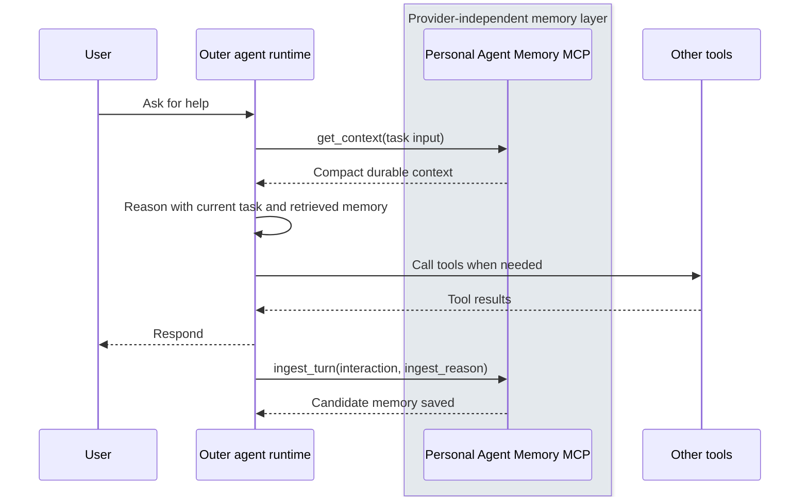

[Chinese README](README.zh.md)

# Personal Agent Memory MCP

Personal Agent Memory MCP is a provider-independent memory layer for AI
assistants. It gives different agents and model providers a shared place to
read and write persistent context.

It is not meant to run the full agent loop, make general tool-use decisions, or
replace the short-term conversation state managed by an outer runtime such as
Codex, Claude Desktop, Dify, Gemini, ChatGPT, or another agent host.

The project focuses on one boundary: long-term personal memory that lives
outside any single model provider.

## Why I Am Building This

I do not want my assistant memory to be locked inside a single model provider.

In practice, I use different assistants in different contexts: sometimes
ChatGPT, sometimes Claude, sometimes Gemini, and potentially other local or
hosted agents later. Each of those tools has its own context and memory system,
but those memories are disconnected from one another.

The goal of this project is to build a provider-independent memory layer: an
overall assistant brain that can hold persistent context outside any single
model provider, and let different AI agents read from and write to the same
durable memory.

MCP, PostgreSQL, pgvector, embeddings, tags, links, and graph expansion are
implementation choices for that goal. They are not the goal themselves.

## How Agents Use It

This project is designed as a memory sidecar for AI agents.

An outer agent runtime stays responsible for the actual conversation, reasoning,
tool use, and response generation. This memory server only answers two
questions:

1. What durable context should the agent know before working on this task?
2. What part of this interaction is worth saving after the task is done?


```mermaid
sequenceDiagram
  participant User
  participant Agent as Outer agent runtime
  box rgba(235, 245, 255, 0.45) Provider-independent memory layer
    participant Memory as Personal Agent Memory MCP
  end
  participant Tools as Other tools

  User->>Agent: Ask for help
  Agent->>Memory: get_context(task input)
  Memory-->>Agent: Compact durable context
  Agent->>Agent: Reason with current task and retrieved memory
  Agent->>Tools: Call tools when needed
  Tools-->>Agent: Tool results
  Agent-->>User: Respond
  Agent->>Memory: ingest_turn(interaction, ingest_reason)
  Memory-->>Agent: Candidate memory saved
```

This keeps memory outside the model provider while still making it available to
any assistant runtime that can speak the supported interface.

## Entry Points

The main agent-facing entry point is MCP.

- `get_context`: read relevant durable memory for the current task.
- `ingest_turn`: write candidate memory from an interaction, with an explicit
  `metadata.ingest_reason`.

There is also a small REST user API for user management, but it is not the
primary interface for agent memory.

REST maintenance supports candidate review and diary creation. Remaining work includes:
- updating profile-derived memory;
- normalizing tags;
- repairing and updating links;
- archiving stale or superseded memory.

## Design Principles

- Memory should be provider-independent, not owned by ChatGPT, Claude, Gemini,
  or any single model vendor.
- Recent chat and durable memory are different things. The outer runtime owns
  short-term conversation state; this project owns long-term memory.
- Memory should be explicit. The caller must provide an `ingest_reason` instead
  of letting every interaction silently become permanent memory.
- Memory should be inspectable and maintainable. Notes, diary entries, profile
  memory, tags, links, and lifecycle events should remain understandable outside
  any one agent session.
- Retrieval should return bounded context, not perform reasoning on behalf of
  the agent.
- Implementation details should be replaceable as long as the memory contract
  remains stable.

## Quick Start

Pending. The local development flow is still being shaped.

The expected flow will be:

1. Install Python dependencies with `uv`.
2. Copy `.env.example` to `.env`.
3. Copy `memory.example.json` to `memory.json`.
4. Start PostgreSQL + pgvector and Ollama.
5. Run database migrations.
6. Start the stdio MCP server locally, or the unified HTTP server for deployment.
7. Run the smoke test against the real MCP tool boundary.

For now, the Chinese README has the most complete local setup notes:
[中文 Quick Start](README.zh.md#quick-start).

## Expected Lifecycle

The expected memory lifecycle is:

1. Read: an agent asks for relevant durable context.
2. Use: the agent reasons with that context in its own runtime.
3. Write: the agent saves meaningful outcomes or observations as candidate
   memory.
4. Review: maintenance workflows clean up, merge, split, link, and organize
   candidates.
5. Activate: reviewed memory becomes part of the long-term assistant brain.
6. Archive: stale, duplicate, or superseded memory is kept out of active
   retrieval.

Memory item status is intentionally simple:

```text
candidate -> active -> archived
```

## P0 Scope

P0 focuses on durable text memory:

- `note`: explicit knowledge, ideas, project notes, and reusable information.
- `diary`: chronological daily context and observations.
- `profile_memory`: retrieval-friendly memory derived from the user profile.

Recent chat is intentionally outside the core database for now. The outer agent
runtime should manage short-term conversation state.

## Technical Docs

The README is meant to explain the project intent and usage model. Technical
details live in:

- [Source architecture](src/README.md)
- [MCP server overview](docs/mcp-server.md)
- [MCP tools](docs/mcp-tools.md)
- [Database schema](docs/database/schema.md)
- [Lifecycle diagrams](docs/lifecycle.md)

## Not Yet Done

Planned later work includes:

- better extraction from interactions;
- full-text search and reranking;
- merging reviewed notes across batches;
- tag alias normalization;
- profile stability rules;
- richer link types;
- heat and importance scoring;
- stronger provenance support.

See [TODO](docs/roadmap/TODO.md) for the longer backlog.

### Candidate review and diaries

`POST /maintenance/review-candidates` processes pending candidate notes from all
dates, oldest first. It merges/splits candidates within a batch into new active
notes, preserves source text and provenance, copies tags and graph edges, links
related active notes, and archives the consumed candidates. Existing active
notes are references and are not rewritten. Canonical profile updates and tag
alias consolidation remain future work.

Use `{"dry_run": true, "limit": 3}` to preview. The default limit is 10 (maximum
50); continue while `has_more` is true. Diary entries use original source dates,
including ingest timestamps, rather than the review date. Later batches refresh
that day's diary using earlier reviewed source material as well. All database
writes for a batch are atomic; failed validation leaves candidates pending.

`GET /diary/YYYY-MM-DD` returns the authenticated user's diary and links, or 404.
The existing `POST /maintenance/daily-diary` remains a standalone date-summary
utility; it does not review candidates. Both maintenance endpoints support
`dry_run` and use the existing user API token in the Bearer header.

The [workflow](.github/workflows/daily-diary.yml) reviews candidates at 10:17 UTC,
up to 10 batches of 5. Configure `MEMORY_BASE_URL` and `MEMORY_DIARY_TOKEN` GitHub
repository secrets, deploy the new server, and add the workflow to the default
branch to enable it. Manual runs default to preview and no longer accept a date.
See the [Chinese setup guide](README.zh.md) for API behavior and limits.

### Model usage ledger

Provider calls are recorded separately in `logs/model-usage.sqlite3` (override with
`MEMORY_USAGE_LOG_PATH`; use a persistent mount in containers). Records include
run/call IDs, model, operation, system-prompt hash, reported input/output tokens,
latency and outcome. Missing usage is NULL, never zero. Dry runs, retries and calls
whose output later fails validation are retained independently of memory transactions.
No prompt/response text or credentials are logged. Successful maintenance responses
include `usage_run_id`. See the Chinese README for fields and querying examples.


## Role-separated message ingestion

See [message source schema and rollout](docs/database/message-sources.md) for `ingest_messages`, reply links, multi-valued content kinds, and compatibility. No `turn_id` is required. Legacy `ingest_turn` remains available.


Daily workflow controls: manual runs default to `dry_run=true` and preview one batch.
Scheduled runs save results. `batch_size` accepts 1–5 (default 5); `max_batches` accepts
1–10 (default 10). The Actions job summary includes counts and server usage run IDs,
never note/diary bodies. Token counts stay in the server's usage ledger. A timeout does
not automatically retry a POST because server completion may be unknown. The workflow
stops starting batches after 30 minutes (45-minute job limit).

The Action calls the deployed `/maintenance/review-candidates` endpoint; it does not
run the local Python implementation or deploy it. Deploy current code and migrations
006/007 first to use selective work summaries and the new source schema.
