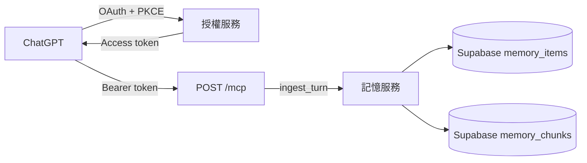
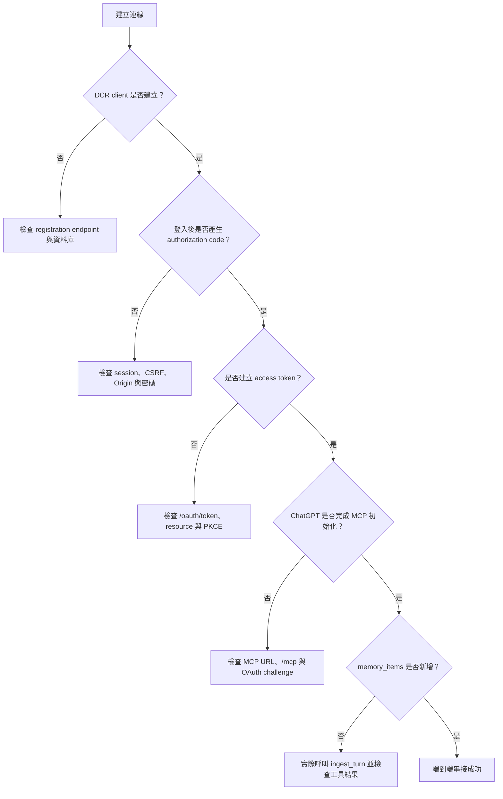
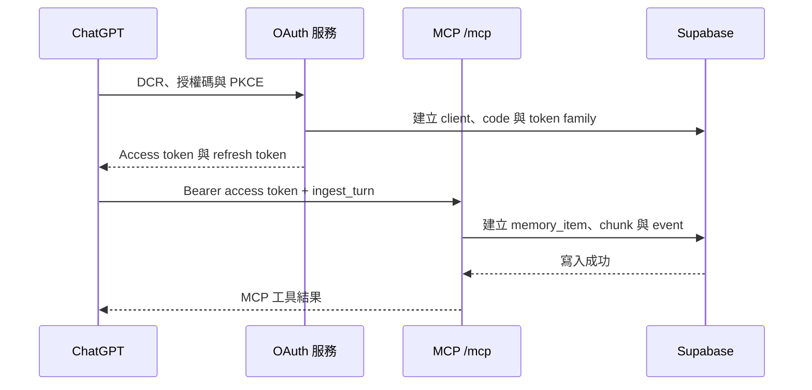

# ChatGPT OAuth 與 MCP 串接障礙排查紀錄

本文件整理 Personal Agent Memory 串接 ChatGPT 遠端 MCP 時實際遇到的問題、判斷依據、修正方式與最終驗證結果。目標不是只記錄單一錯誤，而是建立一條可重複使用的排查路徑，避免把 OAuth 登入、Token 交換、MCP 初始化與記憶寫入混為一談。

最後更新：2026-09-20。

## 最終結果

完整鏈路已驗證成功：



最終 Supabase 驗證結果：

| 項目 | 結果 |
| --- | --- |
| ChatGPT OAuth client | 已建立新的有效 client |
| Resource | `https://second-brain-x2iu.onrender.com/mcp` |
| Scopes | `memory:read`、`memory:write` |
| Access token | 已建立且有效 |
| Refresh token | 已建立且有效 |
| 記憶寫入 | 已由 `chatgpt` 來源寫入 |
| 記憶標題 | `成功連接上 ChatGPT。` |
| 寫入原因 | `explicit_memory_request` |
| Chunk | 已建立 1 筆，可供向量搜尋 |

最終測試結果為 `169 passed, 32 skipped`，Ruff 檢查通過。

## 先分清楚五個階段

ChatGPT 顯示的錯誤通常很籠統。排查時應先判斷流程停在哪一層：



各階段最可靠的判斷依據如下：

| 階段 | 主要證據 |
| --- | --- |
| DCR | `oauth_clients` 出現 ChatGPT client |
| 瀏覽器授權 | `oauth_authorization_requests.consumed_at` 有值，且產生 code |
| Token 交換 | `oauth_token_families`、`oauth_access_tokens`、`oauth_refresh_tokens` 出現新記錄 |
| MCP 初始化 | `/mcp` 可回傳正確 challenge，ChatGPT 能載入工具清單 |
| 記憶寫入 | `memory_items`、`memory_chunks` 與 `memory_item_events` 出現新資料 |

## 最終正確設定

ChatGPT 建立連線時必須使用完整 MCP URL：

```text
https://second-brain-x2iu.onrender.com/mcp
```

不得只填網域根路徑：

```text
https://second-brain-x2iu.onrender.com
```

Render 設定檔中的公開 MCP URL 也必須包含 `/mcp`：

```json
{
  "mcp_http": {
    "path": "/mcp",
    "public_url": "https://second-brain-x2iu.onrender.com/mcp"
  }
}
```

另一種等效設定方式，是在 Render 設定只有 origin 的環境變數：

```dotenv
PUBLIC_BASE_URL=https://second-brain-x2iu.onrender.com
```

當 `PUBLIC_BASE_URL` 有值時，服務會將它與 `mcp_http.path=/mcp` 組合成 resource。若未設定 `PUBLIC_BASE_URL`，`mcp_http.public_url` 本身就必須是完整 MCP URL。

最終應公開下列端點：

| 用途 | URL |
| --- | --- |
| MCP | `https://second-brain-x2iu.onrender.com/mcp` |
| Protected resource metadata | `https://second-brain-x2iu.onrender.com/.well-known/oauth-protected-resource/mcp` |
| Authorization server metadata | `https://second-brain-x2iu.onrender.com/.well-known/oauth-authorization-server` |
| Dynamic Client Registration | `https://second-brain-x2iu.onrender.com/oauth/register` |
| 瀏覽器授權 | `https://second-brain-x2iu.onrender.com/oauth/authorize` |
| Token 交換 | `https://second-brain-x2iu.onrender.com/oauth/token` |

## 障礙一：Dynamic Client Registration 回傳 503

### 症狀

ChatGPT 顯示：

```text
Dynamic client registration failed:
registration endpoint returned 503 (temporarily_unavailable)
```

### 判讀

`POST /oauth/register` 已經抵達服務，但服務在建立 `oauth_clients` 記錄時無法正常使用 PostgreSQL。這不是 callback、PKCE 或登入密碼問題。

### 同期出現的資料庫訊息

```text
schema "pg_pgrst_no_exposed_schemas" does not exist
```

這不是本專案 migration 應建立的 application schema，因此沒有用新增同名 schema 的方式掩蓋問題。實際處理方向是重新確認 PostgreSQL 連線字串、連線端點與 migrations 是否真的套用到同一個 Supabase database。

### Supabase IPv6 提示

Supabase 顯示「Direct connections use IPv6 by default」時，意思不是要把 ChatGPT 或 Render IP 加入白名單。它表示 direct database hostname 預設需要 IPv6；若執行環境只有 IPv4，應使用 Supabase 提供的 pooler 連線字串，或購買 dedicated IPv4 add-on。

### 修正與驗證

1. 將 `DATABASE_URL` 改為執行環境可連線的 Supabase PostgreSQL URL。
2. 確認它是 `postgresql://` 或 `postgres://`，不是 Supabase REST API URL。
3. 對同一個 `DATABASE_URL` 執行 migrations 與 doctor。
4. 重新測試 `/oauth/register`，確認回傳 `201` 並在 `oauth_clients` 建立資料。

```bash
scripts/db/migrate.sh --database-url
scripts/db/doctor.sh --database-url
```

## 障礙二：不確定管理 CLI 修改本機還是遠端帳號

### 症狀

執行：

```bash
uv run memory-admin --env-file .env set-password admin
```

但無法確定密碼設定在哪一個 database。

### 原因與規則

CLI 操作目標完全由它讀到的 `DATABASE_URL` 決定：

- `.env` 指向本機 PostgreSQL，就修改本機。
- `.env` 指向 Supabase，就修改遠端。
- 已存在的 process environment 變數優先於 `.env`。

`admin` 只是由管理員建立的帳號名稱；資料庫內部使用者 ID 可以是另一個值。本次最終記憶與 OAuth token 均綁定 `user_id = 0`。

### 安全做法

執行前先使用不輸出密碼的 doctor 或管理查詢確認目標主機，再設定密碼。不要在指令列參數中直接放入密碼。

## 障礙三：登入後只得到 `{"error":"invalid_request"}`

### 症狀

即使帳號密碼正確，登入頁仍可能回傳：

```json
{"error":"invalid_request"}
```

### 問題

原本的錯誤過於籠統，無法區分：

- Cookie 遺失或被替換。
- CSRF token 不符。
- 授權請求過期。
- 同一筆請求已被消耗。
- 同一瀏覽器重新發起授權後，舊頁面失效。

此外，早期 session 設計讓重新開啟授權頁時較容易讓前一個表單失效，使用者只會看到無法理解的 JSON。

### 修正

Phase 8 加入下列改善：

- 同一瀏覽器可以沿用短效 session，但每個授權頁保有自己的 request。
- CSRF token 由 session secret 與 request ID 透過 HMAC-SHA-256 導出。
- 完成其中一筆授權時，只消耗該筆 request。
- 無效表單改顯示繁體中文復原頁。
- 提供「返回」與「清除登入狀態」操作。
- Render 日誌記錄不含帳號、密碼、Token 或 hash 的安全原因代碼。

對應 migration：

```text
migrations/005_oauth_session_recovery.sql
```

## 障礙四：授權表單被 `origin_or_content_type` 拒絕

### 症狀

Render 日誌顯示：

```text
OAuth authorization form rejected: origin_or_content_type
```

### 根因

ChatGPT 開啟的受限瀏覽器或 webview 可能在表單提交時送出：

```http
Origin: null
```

原本的 CSRF 防護只接受服務本身的 origin，因而把合法的 ChatGPT webview 提交當成跨站請求。

### 修正

表單現在分開檢查 Origin 與 Content-Type：

- Origin 接受服務本身、未提供，或受限 webview 使用的 `null`。
- Content-Type 仍必須是 `application/x-www-form-urlencoded`。
- 其他 origin 仍會被拒絕。
- 日誌原因拆成 `origin_mismatch` 與 `invalid_content_type`，不再混成一個代碼。

這項修正不會取消 CSRF token、cookie 或 request 綁定。

對應提交：`c7fe3e3 Allow opaque origins for OAuth form submissions`。

## 障礙五：誤以為需要設定 ChatGPT URL

### 疑問

看到 Origin 或 callback 錯誤時，很容易以為需要把 ChatGPT 網址填入 `.env`。

### 正確關係

這裡有三個不同 URL：

| 名稱 | 來源 | 用途 |
| --- | --- | --- |
| `PUBLIC_BASE_URL` | 我們設定 | 自己的 Render 服務 origin |
| `redirect_uri` | ChatGPT 透過 DCR 登記 | OAuth 完成後返回 ChatGPT |
| MCP URL | 建立 ChatGPT 連線時填入 | ChatGPT 實際呼叫的遠端 MCP endpoint |

本次 DCR 登記的 callback 是：

```text
https://chatgpt.com/connector_platform_oauth_redirect
```

它由 ChatGPT 提交並保存於 `oauth_clients.redirect_uris`，不應拿來當 `PUBLIC_BASE_URL`。`PUBLIC_BASE_URL` 必須是自己的 Render origin。

## 障礙六：返回 ChatGPT 後顯示籠統連線錯誤

### 症狀

瀏覽器已經跳回 ChatGPT，但 ChatGPT 顯示：

```text
連線至 personal_brain 時發生問題。請稍後再試一次。
```

### 如何定位

Supabase 當時顯示：

- Authorization request 已消耗。
- Authorization code 已建立。
- `oauth_token_families = 0`。
- `oauth_access_tokens = 0`。
- `oauth_refresh_tokens = 0`。

因此可以排除帳號密碼與 callback，問題位於 `POST /oauth/token`。

### 第一個相容性問題：拒絕額外參數

原本 Token endpoint 使用嚴格欄位白名單，遇到 ChatGPT 額外送出的 `scope` 或擴充參數就回傳 `invalid_request`。OAuth 的未識別擴充參數應被忽略，不應讓合法交換失敗。

修正後：

- 忽略未識別的擴充參數。
- 仍拒絕不支援的 client secret 與 client assertion。
- 加入不含敏感值的 Token 拒絕原因日誌。

常見日誌格式：

```text
OAuth token request rejected: <reason>
```

對應提交：`d7d6b0b Log OAuth rejection reasons and ignore extension parameters`。

## 障礙七：Token 交換出現 `invalid_code_exchange_binding`

### 症狀

Render 日誌顯示：

```text
OAuth token request rejected: invalid_code_exchange_binding
```

### 根因

Protected resource metadata 與瀏覽器授權使用經過 URL 正規化的值：

```text
https://second-brain-x2iu.onrender.com/
```

Token endpoint 卻直接使用未正規化的設定值：

```text
https://second-brain-x2iu.onrender.com
```

OAuth resource 必須精確字串比對。即使只差網域根路徑最後一個 `/`，也會被視為不同 resource。

### 修正

Token endpoint 改用與 discovery、authorization endpoint 相同的 `AnyHttpUrl` 正規化方式，並加入網域根路徑的回歸測試。

對應提交：`c255853 Canonicalize OAuth resource URLs in token exchange`。

## 障礙八：OAuth 成功，但 ChatGPT 顯示「設定連線時發生問題」

### 症狀

Supabase 已有 token family、access token 與 refresh token，但 ChatGPT 仍無法完成連線。

### 直接證據

公開端點檢查結果：

```text
GET https://second-brain-x2iu.onrender.com/      -> 404
GET https://second-brain-x2iu.onrender.com/mcp   -> 401 OAuth challenge
```

這證明 OAuth 已經成功，但 ChatGPT 回頭初始化 MCP 時使用了錯誤路徑。

### 根因

Render 的 `deploy/render/memory.json` 將 `mcp_http.public_url` 設為網域根路徑，少了 `/mcp`。因此 OAuth token 的 resource、ChatGPT 建立連線時使用的 URL，以及真正掛載 MCP 的路徑沒有對齊。

### 修正

將公開 URL 改為：

```json
"public_url": "https://second-brain-x2iu.onrender.com/mcp"
```

部署後刪除原本失敗的 ChatGPT 連線，再用完整 `/mcp` URL 建立新連線。舊 token 的 audience 是錯誤的網域根路徑，不應沿用。

對應提交：`5b2abe4 Fix Render MCP public URL`。

## Cloudflare Token：不是 OAuth，但會影響記憶寫入

Cloudflare API Token 不參與 ChatGPT OAuth 登入，但 Cloudflare Workers AI 是目前 embeddings 與 summary provider。OAuth 與 MCP 即使都成功，若 Cloudflare Token 無效，`ingest_turn` 仍可能在產生 embedding 或摘要時失敗。

排查時應把兩類 Token 分開：

| Token | 用途 |
| --- | --- |
| OAuth access token | ChatGPT 呼叫 MCP 時驗證使用者與 scopes |
| Cloudflare API Token | 後端呼叫 Workers AI embeddings 與 summary models |

本次已分別用實際 embedding 與 summary 請求驗證新的 Cloudflare Token。曾經在終端輸出中意外顯示舊 Token，因此立即輪替；任何曾出現在日誌、shell output 或對話中的 Token 都應視為已外洩並撤銷。

## 日誌代碼速查

| 日誌或錯誤 | 所在階段 | 優先檢查 |
| --- | --- | --- |
| `registration endpoint returned 503` | DCR | `DATABASE_URL`、Supabase 連線、migrations |
| `temporarily_unavailable` | DCR 或 Token | PostgreSQL 是否可用、連線池狀態 |
| `origin_or_content_type` | 授權表單 | 舊版複合錯誤；更新版本後查看細分原因 |
| `origin_mismatch` | 授權表單 | Origin 是否為服務 origin、未提供或 `null` |
| `invalid_content_type` | 授權表單 | 是否為 form-urlencoded |
| `session_or_request_expired` | 授權表單 | Cookie、10 分鐘期限、是否沿用舊頁面 |
| `invalid_code_exchange_binding` | Token 交換 | code 格式、PKCE、client、callback、resource |
| `authorization_code_not_found_or_expired` | Token 交換 | Code 是否過期、已使用，或只是人工探測請求 |
| ChatGPT「連線至…時發生問題」 | Callback 或 Token | Supabase 是否有 code 與 token family |
| ChatGPT「設定連線時發生問題」 | MCP 初始化 | URL 是否包含 `/mcp`、endpoint 是否回正確 challenge |

## 安全的診斷方式

### 檢查公開 discovery

```bash
curl --max-time 20 \
  https://second-brain-x2iu.onrender.com/.well-known/oauth-authorization-server

curl --max-time 20 \
  https://second-brain-x2iu.onrender.com/.well-known/oauth-protected-resource/mcp
```

Protected resource metadata 的 `resource` 應為：

```text
https://second-brain-x2iu.onrender.com/mcp
```

### 檢查 MCP challenge

```bash
curl --max-time 20 -D - \
  -H 'Accept: application/json, text/event-stream' \
  https://second-brain-x2iu.onrender.com/mcp
```

未帶 Token 時預期回傳 `401`，並包含：

```http
WWW-Authenticate: Bearer ... resource_metadata="https://second-brain-x2iu.onrender.com/.well-known/oauth-protected-resource/mcp"
```

### 從 Supabase 判斷 OAuth 是否成功

下列查詢不讀取原始 Token；資料庫本來也只保存 SHA-256 hash：

```sql
select
  left(f.client_id, 10) as client_prefix,
  f.user_id,
  f.resource,
  f.scopes,
  f.created_at,
  f.expires_at,
  f.revoked_at is not null as revoked,
  count(distinct a.token_hash) as access_token_count,
  count(distinct r.token_hash) as refresh_token_count
from oauth_token_families f
left join oauth_access_tokens a on a.family_id = f.id
left join oauth_refresh_tokens r on r.family_id = f.id
group by f.id
order by f.created_at desc;
```

### 確認記憶真的寫入

```sql
select
  mi.user_id,
  mi.type,
  mi.ingest_reason,
  mi.title,
  mi.status,
  mi.created_at,
  count(distinct mc.id) as chunk_count,
  array_remove(array_agg(distinct mie.source), null) as event_sources
from memory_items mi
left join memory_chunks mc on mc.memory_item_id = mi.id
left join memory_item_events mie on mie.memory_item_id = mi.id
group by mi.id
order by mi.created_at desc
limit 10;
```

只有出現 OAuth token，不能證明工具已被呼叫；只有 `memory_items` 與 `memory_chunks` 出現新的 ChatGPT 來源資料，才能證明完整寫入成功。

## 本次最終端到端驗證

新連線建立後，Supabase 出現：

```text
OAuth client
  resource: https://second-brain-x2iu.onrender.com/mcp
  scopes: memory:read, memory:write

Token family
  user_id: 0
  active access token: true
  active refresh token: true
  revoked: false

Memory item
  title: 成功連接上 ChatGPT。
  type: note
  ingest_reason: explicit_memory_request
  source: chatgpt
  chunk_count: 1
```

因此最終驗證涵蓋的不只是「登入成功」，而是：



## 後續建議

1. 為 MCP request 與工具呼叫加入不含輸入內容的 audit log，例如 client prefix、user ID、tool name、結果與 latency。
2. 增加一個安全的管理診斷命令，輸出各 OAuth 階段的筆數與最新狀態，不輸出 Token、hash、密碼或完整 session ID。
3. 在部署後 smoke test 同時驗證 discovery、DCR、Token exchange、`tools/list`、`get_context` 與 `ingest_turn`。
4. 對舊的錯誤 resource token family 設定管理清理流程；不要直接用未限定條件的 SQL 刪除。
5. Render 日誌應保留安全原因代碼，但不得記錄 authorization code、access token、refresh token、PKCE verifier、密碼或 Cloudflare Token。

## 相關文件

- [OAuth discovery 與 client 註冊](oauth-discovery.md)
- [OAuth 登入、授權與復原](oauth-login.md)
- [OAuth Token 兌換與更新](oauth-token.md)
- [OAuth MCP 存取驗證](oauth-mcp-auth.md)
- [OAuth 資料表與授權流程](oauth-storage.md)
- [帳號管理](account-management.md)
- [MCP 工具](mcp-tools.md)
