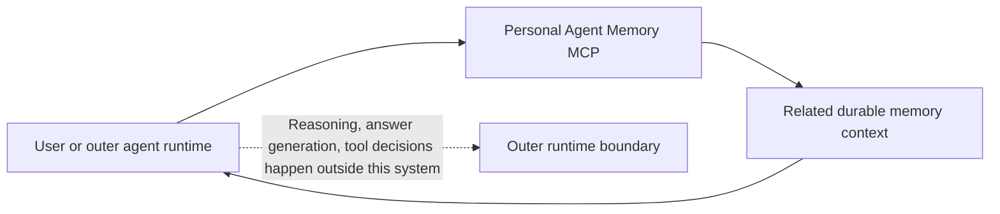
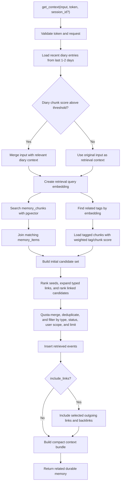
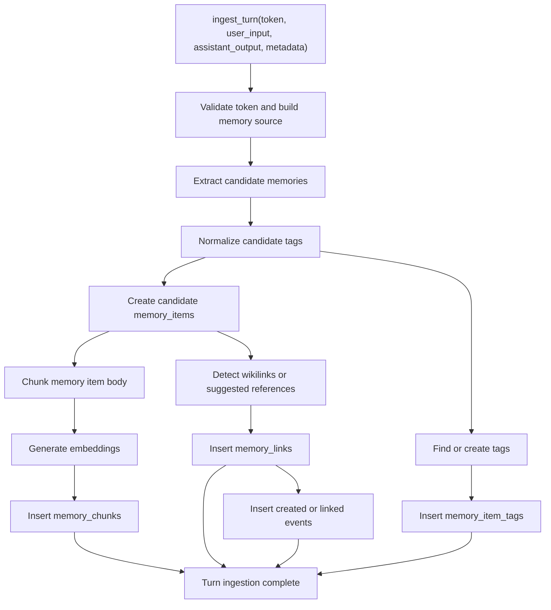
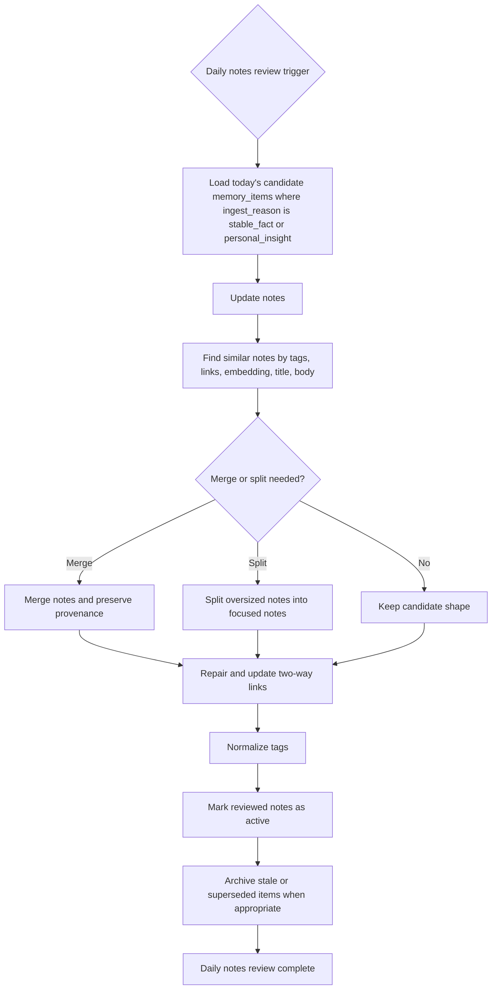
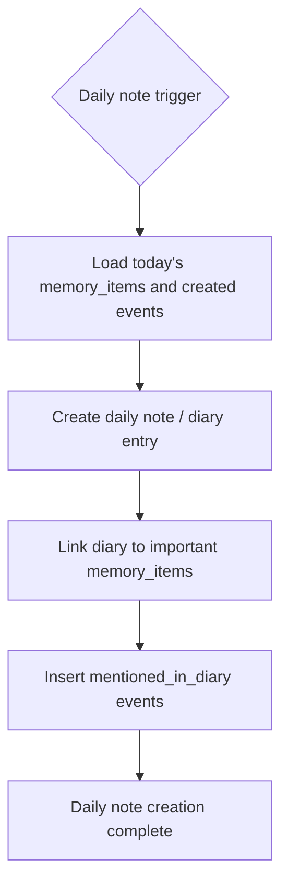
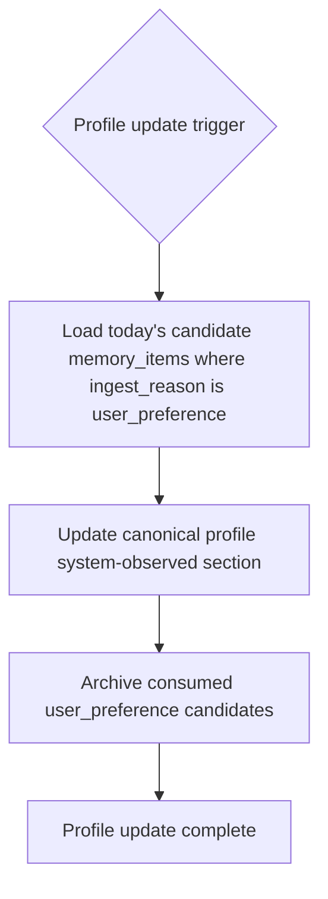
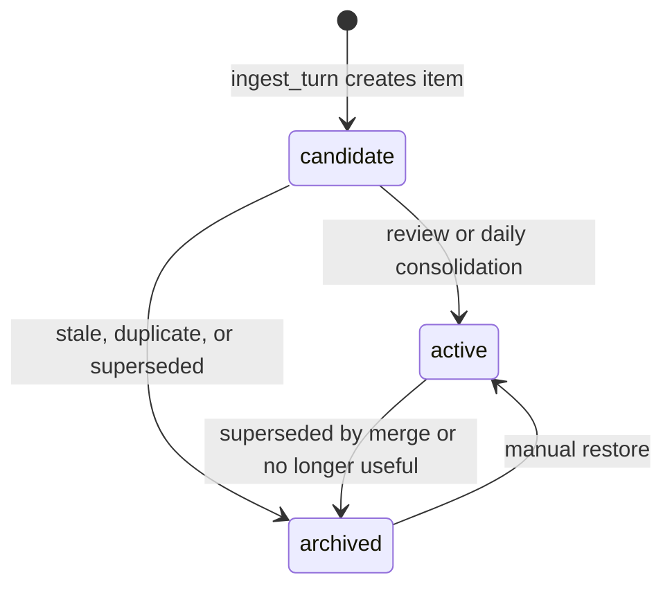
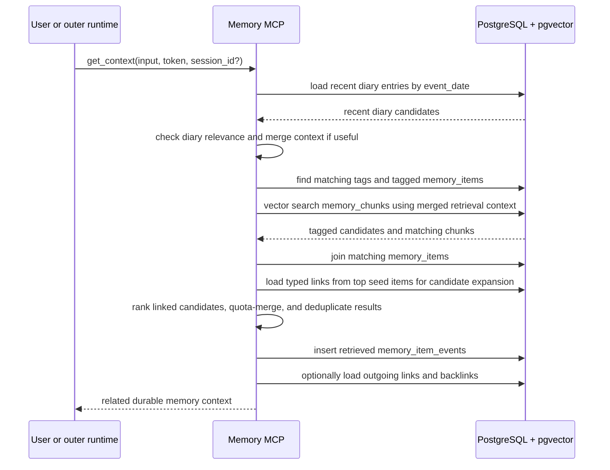
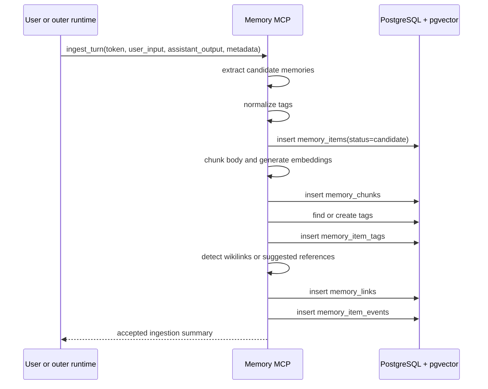

# Personal Agent Memory Lifecycle

這份文件描述 Personal Agent Memory MCP 自己負責的生命週期。核心邊界是：本系統不負責 reasoning、不負責完整 agent loop、不負責一般工具決策；它只負責根據輸入吐出相關 durable memory，並在 interaction 結束後接收資料進行保存與整理。

## System Boundary

## Durable Context Lookup Lifecycle

Notes:

- Tags are not attached during normal durable context lookup.
- Tags are still important retrieval references: matched tags can add candidate memory items or boost ranking, but they do not need to be returned.
- Recent diary entries are checked with embedding similarity before RAG because they carry short-term life/work context that semantic search may miss.
- If recent diary is relevant, it becomes part of the retrieval context before semantic search.
- P0 links only support `references`, which can affect candidate expansion and backlinks.
- `get_context` should return relevant memory, not perform reasoning over that memory.

## Ingestion Lifecycle

## Daily Notes Review Lifecycle

## Daily Note Creation Lifecycle

## Profile Update Lifecycle

## Memory Item Status

## Retrieval Shape

## Write Shape

