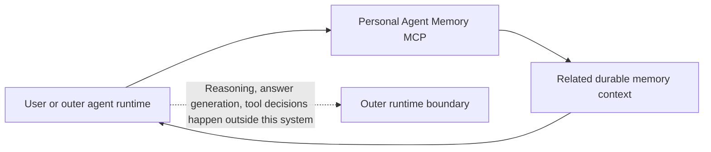
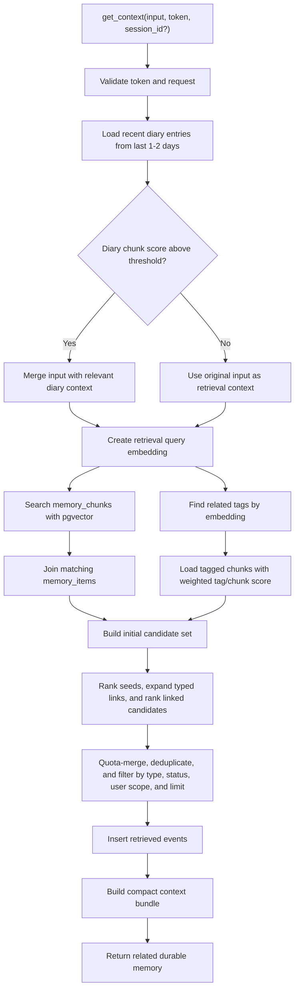
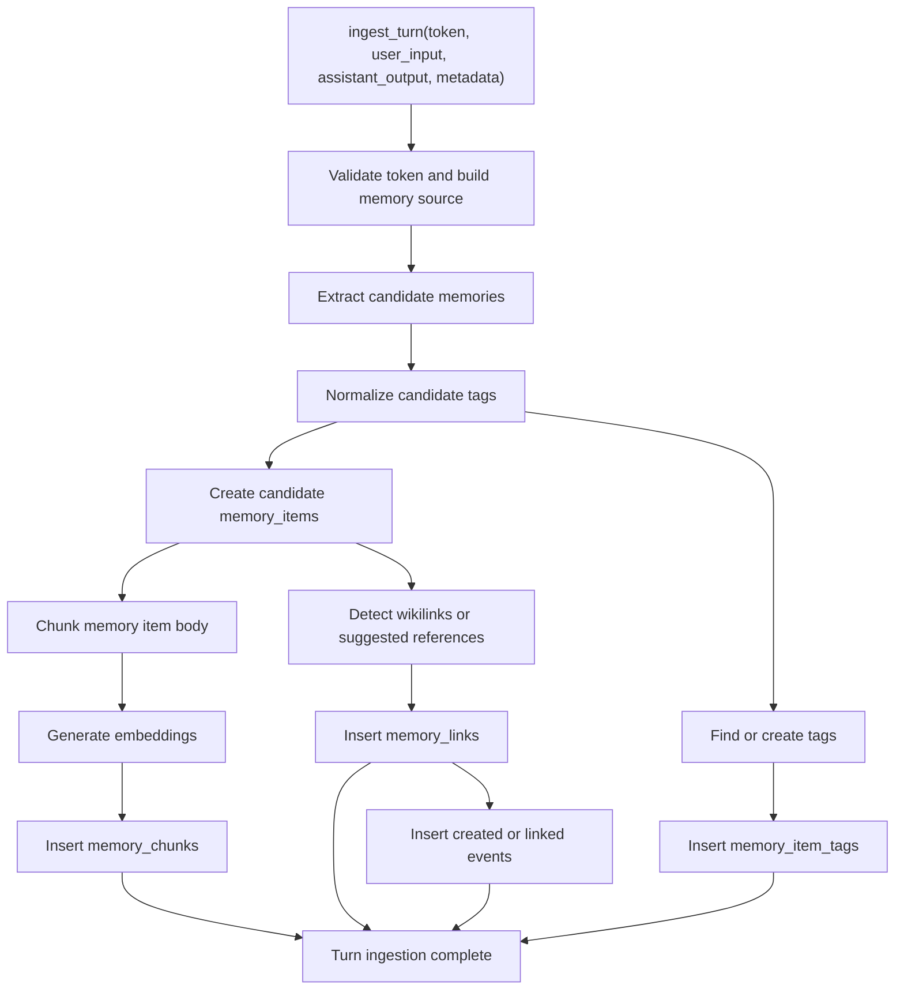
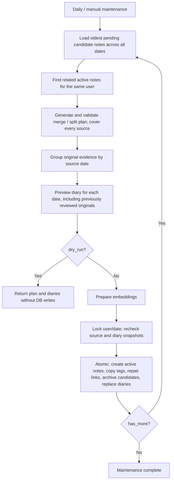
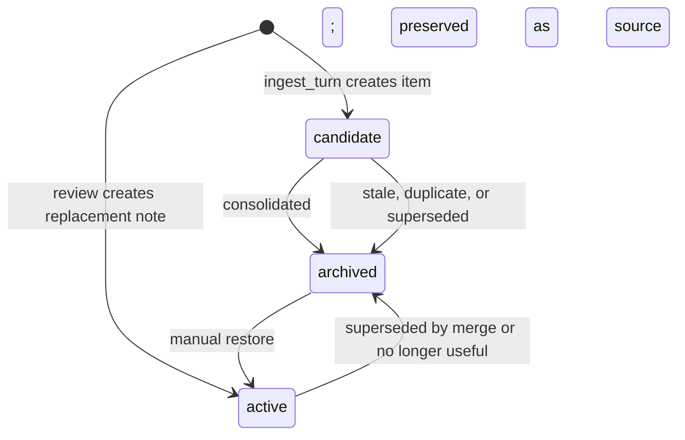
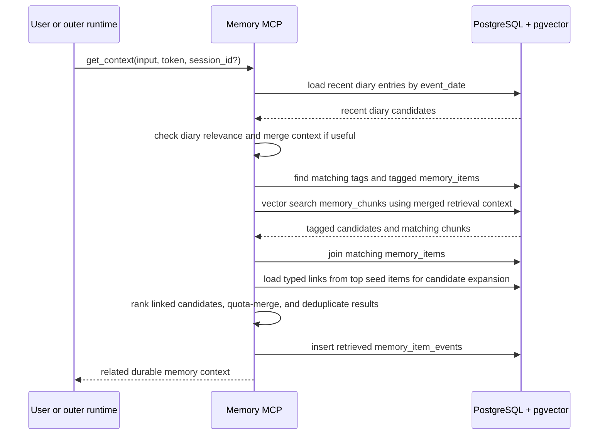
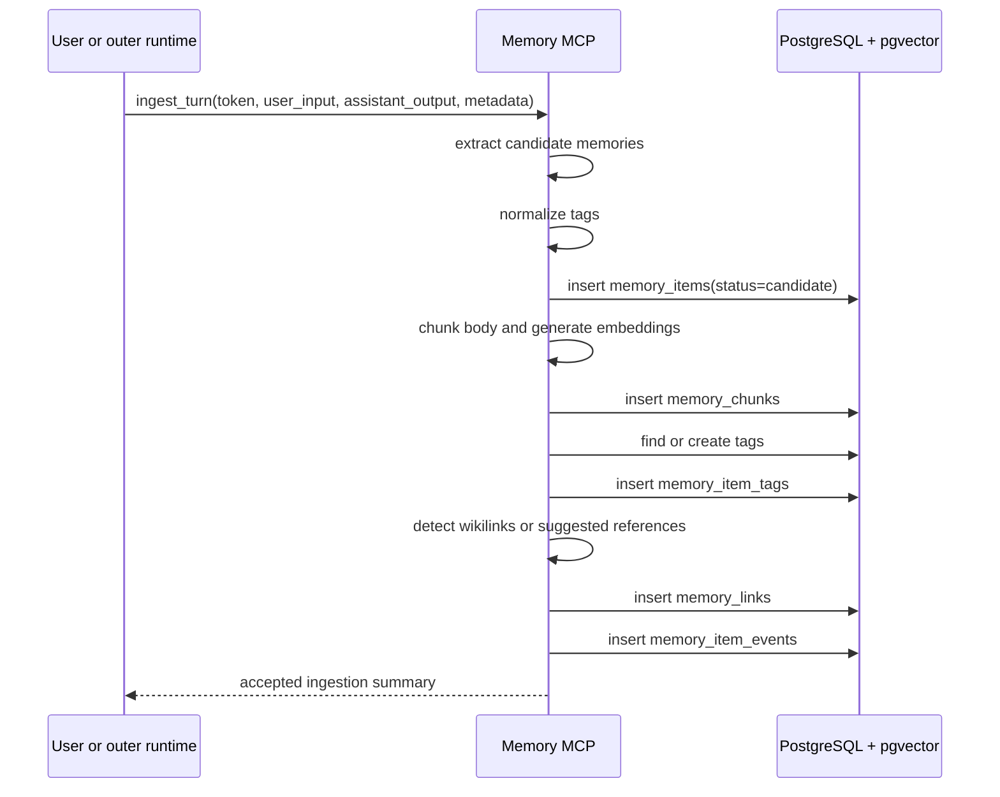

# Personal Agent Memory Lifecycle

這份文件描述 Personal Agent Memory MCP 自己負責的生命週期。核心邊界是：本系統不負責 reasoning、不負責完整 agent loop、不負責一般工具決策；它只負責根據輸入吐出相關 durable memory，並在 interaction 結束後接收資料進行保存與整理。

## System Boundary

```mermaid
flowchart LR
  caller["User or outer agent runtime"] --> memoryMcp["Personal Agent Memory MCP"]
  memoryMcp --> durableContext["Related durable memory context"]
  durableContext --> caller

  caller -. "Reasoning, answer generation, tool decisions happen outside this system" .-> outside["Outer runtime boundary"]
```

## Durable Context Lookup Lifecycle

```mermaid
flowchart TD
  request["get_context(input, token, session_id?)"] --> validate["Validate token and request"]
  validate --> recentDiary["Load recent diary entries from last 1-2 days"]
  recentDiary --> diaryRelevant{"Diary chunk score above threshold?"}
  diaryRelevant -- "Yes" --> mergeDiary["Merge input with relevant diary context"]
  diaryRelevant -- "No" --> baseContext["Use original input as retrieval context"]

  mergeDiary --> embedQuery["Create retrieval query embedding"]
  baseContext --> embedQuery
  embedQuery --> tagHints["Find related tags by embedding"]
  tagHints --> tagCandidates["Load tagged chunks with weighted tag/chunk score"]

  embedQuery --> searchChunks["Search memory_chunks with pgvector"]
  searchChunks --> joinItems["Join matching memory_items"]
  joinItems --> seedSet["Build initial candidate set"]
  tagCandidates --> seedSet
  seedSet --> linkPolicy["Rank seeds, expand typed links, and rank linked candidates"]
  linkPolicy --> filterItems["Quota-merge, deduplicate, and filter by type, status, user scope, and limit"]
  filterItems --> logRetrieval["Insert retrieved events"]
  logRetrieval --> compact["Build compact context bundle"]

  compact --> response["Return related durable memory"]
```

Notes:

- Tags are not attached during normal durable context lookup.
- Tags are still important retrieval references: matched tags can add candidate memory items or boost ranking, but they do not need to be returned.
- Recent diary entries are checked with embedding similarity before RAG because they carry short-term life/work context that semantic search may miss.
- If recent diary is relevant, it becomes part of the retrieval context before semantic search.
- P0 links only support `references`, which can affect candidate expansion.
- `get_context` should return relevant memory, not perform reasoning over that memory.

## Ingestion Lifecycle

```mermaid
flowchart TD
  ingest["ingest_turn(token, user_input, assistant_output, metadata)"] --> source["Validate token and build memory source"]
  source --> extract["Extract candidate memories"]
  extract --> normalizeTags["Normalize candidate tags"]

  normalizeTags --> noteCandidate["Create candidate memory_items"]
  noteCandidate --> chunk["Chunk memory item body"]
  chunk --> embed["Generate embeddings"]
  embed --> saveChunks["Insert memory_chunks"]

  normalizeTags --> findTags["Find or create tags"]
  findTags --> itemTags["Insert memory_item_tags"]

  noteCandidate --> detectLinks["Detect wikilinks or suggested references"]
  detectLinks --> saveLinks["Insert memory_links"]

  saveChunks --> done["Turn ingestion complete"]
  itemTags --> done
  saveLinks --> done
  saveLinks --> logWriteEvents["Insert created or linked events"]
  logWriteEvents --> done
```

## Candidate Review and Diary Lifecycle

```mermaid
flowchart TD
  trigger["Daily / manual maintenance"] --> collect["Load oldest pending candidate notes across all dates"]
  collect --> related["Find related active notes for the same user"]
  related --> plan["Generate and validate merge / split plan; cover every source"]
  plan --> dates["Group original evidence by source date"]
  dates --> diary["Preview diary for each date, including previously reviewed originals"]
  diary --> preview{"dry_run?"}
  preview -- Yes --> return["Return plan and diaries without DB writes"]
  preview -- No --> embed["Prepare embeddings"]
  embed --> lock["Lock user/date; recheck source and diary snapshots"]
  lock --> save["Atomic: create active notes, copy tags, repair links, archive candidates, replace diaries"]
  save --> more{"has_more?"}
  more -- Yes --> collect
  more -- No --> done["Maintenance complete"]
```

Original candidates remain available as archived provenance. New notes reference their
sources and related active notes; incoming and outgoing edges carry forward. Existing
active notes are not automatically rewritten. The batch can merge candidates or split
one candidate into multiple notes. Tags are inherited and deduplicated by ID; alias
normalization is future work.

Source date uses `event_date`, then ingest event `metadata.timestamp` in the configured
timezone, then original `created_at`. Cross-date merged notes preserve all source dates
in their created event. Diary text is generated only from that day's original evidence.
Review output never becomes a new event on its processing date. A later candidate for
an existing date rebuilds that diary with prior reviewed evidence and archives the old
version. Any failed write rolls back the entire batch; conflicts can be retried.

`POST /maintenance/daily-diary` remains a separate single-date summary utility. It
includes pending originals as well as originals archived by candidate review, excludes
review-generated notes, and does not change candidate status.

## Profile Update Lifecycle

Canonical profile updates are not implemented. Preferences participate in candidate
review as durable notes. A future profile updater must track its own processed state
and read provenance; it must not rely on preferences remaining in candidate status.

## Memory Item Status

```mermaid
stateDiagram-v2
  [*] --> candidate: ingest_turn creates item
  candidate --> archived: consolidated; preserved as source
  [*] --> active: review creates replacement note
  candidate --> archived: stale, duplicate, or superseded
  active --> archived: superseded by merge or no longer useful
  archived --> active: manual restore
```

## Retrieval Shape

```mermaid
sequenceDiagram
  participant Caller as User or outer runtime
  participant MCP as Memory MCP
  participant DB as PostgreSQL + pgvector

  Caller->>MCP: get_context(input, token, session_id?)
  MCP->>DB: load recent diary entries by event_date
  DB-->>MCP: recent diary candidates
  MCP->>MCP: check diary relevance and merge context if useful
  MCP->>DB: find matching tags and tagged memory_items
  MCP->>DB: vector search memory_chunks using merged retrieval context
  DB-->>MCP: tagged candidates and matching chunks
  MCP->>DB: join matching memory_items
  MCP->>DB: load typed links from top seed items for candidate expansion
  MCP->>MCP: rank linked candidates, quota-merge, and deduplicate results
  MCP->>DB: insert retrieved memory_item_events
  MCP-->>Caller: related durable memory context
```

## Write Shape

```mermaid
sequenceDiagram
  participant Caller as User or outer runtime
  participant MCP as Memory MCP
  participant DB as PostgreSQL + pgvector

  Caller->>MCP: ingest_turn(token, user_input, assistant_output, metadata)
  MCP->>MCP: extract candidate memories
  MCP->>MCP: normalize tags
  MCP->>DB: insert memory_items(status=candidate)
  MCP->>MCP: chunk body and generate embeddings
  MCP->>DB: insert memory_chunks
  MCP->>DB: find or create tags
  MCP->>DB: insert memory_item_tags
  MCP->>MCP: detect wikilinks or suggested references
  MCP->>DB: insert memory_links
  MCP->>DB: insert memory_item_events
  MCP-->>Caller: accepted ingestion summary
```

### Evidence-preserving diary rendering

Diary creation now calls the shared `prepare_diary` pipeline per original source.
The model proposes multi-valued categories and keep/omit decisions; the application
checks complete block-ID coverage and retains all substantive source sections.
Only deterministic bookkeeping exclusions are applied. Structural failures fall back
to verbatim evidence rather than a second generated summary. Preview `preparation`
replaces `summary_prompt`; saved events retain hashes and offsets. See
[extractive preparation](database/message-sources.md#extractive-diary-preparation-extractive-v1).

Operational reports now use selective-summary-v2: a short local summary followed by
a model scope check, with original-excerpt fallback. Personal material remains verbatim.
See [selective work summaries](database/message-sources.md#selective-work-summaries-selective-summary-v2).
