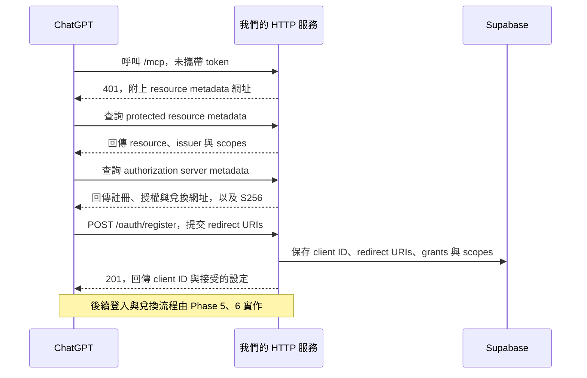

# OAuth discovery 與 client 註冊（Phase 4）

Phase 4 已提供 discovery 與 Dynamic Client Registration（DCR）。ChatGPT 可以查詢授權設定並註冊 client；登入頁與 token 兌換端點仍待 Phase 5、6 實作，現在尚不能完成整條 OAuth 登入流程。

## 連線順序



## 公開網址設定

在部署環境設定以下變數；本機開發可留空，沿用 `memory.json` 的 `mcp_http.public_url`。

```dotenv
PUBLIC_BASE_URL=https://memory.example.com
```

`PUBLIC_BASE_URL` 必須只有 origin，不包含 `/mcp`、query 或 fragment。正式環境要求 HTTPS；只有 `localhost`、`127.0.0.1`、`::1` 允許 HTTP。

以預設 MCP 路徑 `/mcp` 為例：

| 項目 | 網址 |
| --- | --- |
| Issuer | `https://memory.example.com/`（保留結尾斜線，與 SDK metadata 一致） |
| Resource | `https://memory.example.com/mcp` |
| Resource metadata | `https://memory.example.com/.well-known/oauth-protected-resource/mcp` |
| Resource metadata 根路徑別名 | `https://memory.example.com/.well-known/oauth-protected-resource` |
| Authorization server metadata | `https://memory.example.com/.well-known/oauth-authorization-server` |
| Client 註冊 | `https://memory.example.com/oauth/register` |
| 授權頁（待實作） | `https://memory.example.com/oauth/authorize` |
| Token 兌換（待實作） | `https://memory.example.com/oauth/token` |

Issuer 與 resource 都從固定設定產生，不採用外部請求的 Host 或 forwarded headers。部署時仍需把公開主機名稱加入 `memory.json` 的 `mcp_http.allowed_hosts`，供 MCP transport 驗證。

## 註冊請求與回應

```json
{
  "client_name": "ChatGPT",
  "redirect_uris": ["https://example.com/exact-callback"],
  "token_endpoint_auth_method": "none",
  "grant_types": ["authorization_code", "refresh_token"],
  "response_types": ["code"],
  "scope": "memory:read memory:write"
}
```

Callback 範例只是示意，實際上由 ChatGPT 提交。伺服器驗證後會回傳 `201`，包含接受的設定、隨機 `client_id` 與 `client_id_issued_at`，不發行 client secret。

- Redirect URI 限制 1–10 個；接受 HTTPS 與本機 loopback HTTP，拒絕帳密、fragment、萬用字元、控制字元與反斜線。
- 保存原始 URI 字串。後續授權可使用 `OAuthClientsRepository.allows_redirect()` 精確比對；編碼或尾端斜線不同都視為不同網址，已撤銷的 client 一律拒絕。
- 僅支援 public client 的 `none`、authorization code、選用 refresh token，以及 `code` response type。
- 省略 grants 時預設為 `authorization_code`；省略 scopes 時預設為 `memory:read memory:write`。接受的設定會存入資料庫。
- Discovery 宣告 PKCE `S256`，不宣告尚未支援的 CIMD 或 callback issuer identification。
- 註冊請求最大 16 KiB；每個服務程序每分鐘最多接受 60 次嘗試，超過回傳 `429`。多程序部署需另由入口服務提供共用流量限制。
- 無效 metadata 回傳 `400`；媒體類型錯誤為 `415`；過大為 `413`；資料庫錯誤為 `503`，不回傳資料庫內部訊息。

Client 註冊不會建立使用者，也不代表已取得記憶存取權；取得 token 仍需要後續的登入、授權與 PKCE 驗證。

## 資料庫與驗證

`004_oauth_client_metadata.sql` 在 `oauth_clients` 加入 `grant_types` 與 `scopes`，可重複執行；資料表仍維持 Phase 3 的後端存取限制。

本機端點測試：`uv run pytest tests/test_oauth_discovery.py`。涵蓋 discovery 一致性、401 challenge、註冊成功、URI 精確比對、無效 metadata、請求大小及流量限制。

依據：[OpenAI Docs：MCP Authentication](https://developers.openai.com/plugins/build/auth)。資料表說明：[OAuth 資料表與授權流程](oauth-storage.md)。
