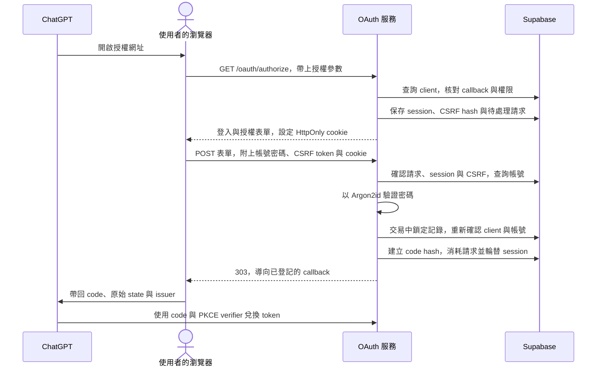
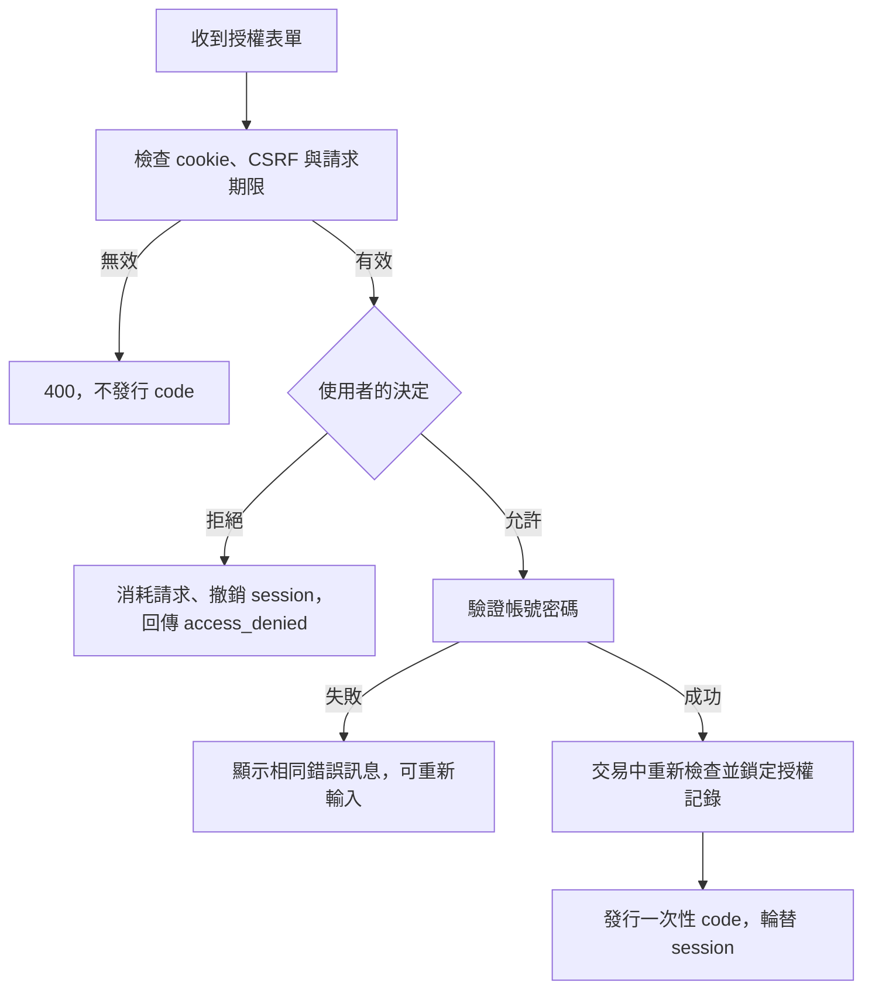

# OAuth 登入與授權（Phase 5）

Phase 5 已提供 `GET /oauth/authorize` 與 `POST /oauth/authorize`。使用者可以登入、確認權限或拒絕授權；成功時回傳一次性 authorization code。Phase 6 已提供 [Token 兌換與更新](oauth-token.md)，可以完成 ChatGPT 的 OAuth 連線流程。

## 使用者會看到什麼？

頁面顯示應用程式名稱、要求的記憶讀取／寫入權限，以及完成後返回的主機名稱。使用者輸入帳號密碼，再按「登入並允許」；也可以直接按「拒絕」。頁面不提供公開註冊。

既有帳號必須先有密碼，例如由你在終端機執行：

```bash
uv run memory-admin set-password admin
```

Username 忽略大小寫；密碼保留原始大小寫與空白。帳號不存在、密碼錯誤、尚未設定密碼或帳號停用，都顯示相同的錯誤訊息。

## 從開啟頁面到取得 code



表單只需要攜帶請求識別值、CSRF token、帳號密碼及允許／拒絕決定。Callback、resource、scopes 與 PKCE challenge 都從資料庫讀取；修改表單中的同名額外欄位不會改變授權範圍。

## 授權參數如何檢查？

| 參數 | 檢查方式 |
| --- | --- |
| `client_id` | 必須是已登記且尚未撤銷的 client，並允許 authorization code grant |
| `redirect_uri` | 與 client 已登記的 URI 完整字串相同，不做前綴比對 |
| `response_type` | 僅接受 `code` |
| `resource` | 必須等於 discovery 公布的 resource |
| `scope` | 不得超出 client 登記的權限與服務支援的權限；省略時使用 client 的 scopes |
| `code_challenge_method` | 必須為 `S256` |
| `code_challenge` | 必須符合 43 字元的 Base64URL 格式；token endpoint 會使用 PKCE verifier 驗證 |
| `state` | 保存並原樣帶回；若未提供，就不加入 callback |

重複的 query 參數會被拒絕。Client 或 callback 未通過驗證時，直接回傳 `400`，不跳轉到外部網址；確認 callback 安全後的 OAuth 參數錯誤才透過 callback 回傳。

所有 OAuth callback（成功或錯誤）均包含 `iss`，與 discovery 的 issuer 完全一致；metadata 已宣告 `authorization_response_iss_parameter_supported: true`。依據：[OpenAI Docs：MCP Authentication](https://developers.openai.com/plugins/build/auth)。

## 允許、拒絕與失敗



Code 綁定 user、client、redirect URI、resource、scopes 與 PKCE challenge。資料庫只保存 code 的 SHA-256 hash，原始 code 只出現在 callback。

完成授權的資料庫交易會重新檢查期限、client 撤銷狀態、callback、權限、帳號啟用狀態及密碼 hash，防止表單開啟後設定改變，卻仍以舊狀態發行 code。請求消耗、code 建立與 session 輪替一起提交；同一請求不能重複發行 code。

## Session、CSRF 與期限

| 項目 | 目前設定 |
| --- | --- |
| 待處理授權請求與登入 session | 10 分鐘 |
| Authorization code | 5 分鐘，只能兌換一次 |
| 正式環境 cookie | `__Host-memory-oauth`，`Secure`、`HttpOnly`、`SameSite=Lax`、`Path=/` |
| 本機 HTTP cookie | `memory-oauth-local`，僅供 loopback 開發 |
| 成功登入 | 建立新的 session secret，撤銷舊 session |
| 拒絕授權 | 消耗請求、撤銷 session 並清除 cookie，不要求密碼 |
| 表單保護 | CSRF token 與 server-side session 綁定；若有 Origin header，必須符合設定的公開 origin |

每次開啟授權頁都建立新的 session，目前不提供免密碼再次授權；同一瀏覽器同時開啟多個授權頁時，新 cookie 會取代舊 cookie，舊頁面需重新開始。

Session 與 CSRF 都是安全亂數，資料庫只保存 hash，因此這個實作不需要額外的 cookie 簽章密鑰。密碼驗證在背景執行緒執行，避免 Argon2id 計算阻塞 HTTP event loop。

## 請求限制與測試

授權網址 query 最大 8 KiB；表單最大 16 KiB。每個服務程序每分鐘最多接受 120 次 GET、30 次 POST，超過回傳 `429`。這是程序內共用限制；多程序部署仍需由入口服務提供共用流量限制。

頁面與 callback 都使用 `Cache-Control: no-store`、`Referrer-Policy: no-referrer`，並禁止 iframe 嵌入。Client 名稱與其他顯示文字均經 HTML escaping；錯誤回應不包含密碼、hash 或資料庫內部訊息。

```bash
uv run pytest tests/test_oauth_login.py
```

設定 `MEMORY_TEST_DATABASE_URL` 後，可執行真實 PostgreSQL 測試：

```bash
uv run pytest tests/test_oauth_login_database.py
```

資料庫測試使用獨立 schema，結束後回滾所有 schema 與測試資料。涵蓋完整表單授權、code 綁定、hash 儲存、重複提交，以及表單開啟後過期、撤銷、停用或修改密碼的情境。
