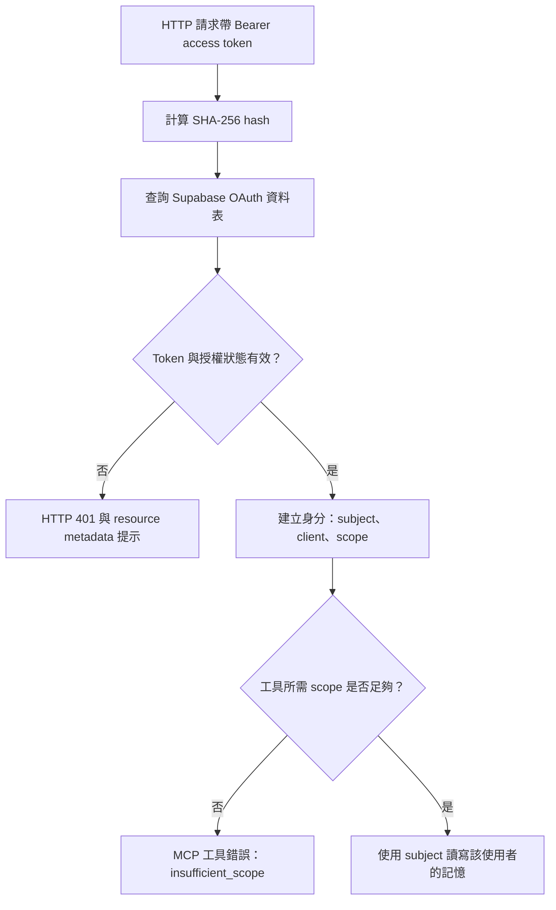
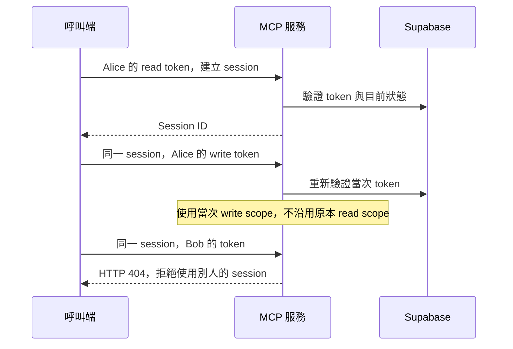

# OAuth MCP 存取驗證

Phase 7 已完成 HTTP MCP 的 opaque access token 驗證與工具權限檢查。Phase 6 的 [`/oauth/token`、code 兌換與 refresh rotation](oauth-token.md) 也已完成，可以從登入頁完成正式 OAuth 連線。

## 一次工具呼叫如何通過驗證？

HTTP MCP 每次請求都查詢資料庫，不快取驗證結果：

- 只查 `oauth_access_tokens`；refresh token、authorization code、舊版 API token 都不能代替 access token。
- Access token 與 token family 都必須未過期、未撤銷，且不能尚未生效。
- Client 必須未撤銷，使用者必須啟用。
- `resource` 必須完全符合服務設定的 MCP URL，不能跨服務使用。
- Token 的 scopes 必須是 family、client 與服務支援 scopes 的子集合。
- 資料庫驗證失敗時拒絕存取，不降級為舊版 API token 驗證。

原始 Bearer token 不會存進資料庫；只以 SHA-256 hash 查詢。驗證結果包含 `subject=user_id`、OAuth `client_id`、scope、resource、到期時間與設定的 issuer。這些資料來自伺服器驗證結果，不來自工具參數。

## 工具權限

| 工具 | 必要 scope | 身分來源 |
| --- | --- | --- |
| `get_context` | `memory:read` | 當次 HTTP 請求驗證後的 subject |
| `ingest_turn` | `memory:write` | 當次 HTTP 請求驗證後的 subject |

不要求每個 token 同時具備讀寫權限。只有讀取權限仍可建立 MCP session、列出工具並呼叫 `get_context`；呼叫 `ingest_turn` 會回傳 MCP `isError=true`，不執行寫入。

Protected resource metadata 會公開支援的兩種 scope。未帶 token 或 token 無效時，HTTP 401 的 `WWW-Authenticate` 會提供 resource metadata URL，讓 client 找到授權設定。

## Session 與使用者隔離

`mcp` 套件將 session 綁定 issuer、client 與 subject。工具另外從當次 HTTP request 取得身分與權限，避免長時間存在的 session 沿用初次登入的 scope。撤銷 token、family、client 或停用帳號，會讓後續請求失敗；不會回溯取消已通過驗證且正在執行的操作。

## 舊版使用方式與資料庫

- HTTP MCP 已切換為 OAuth-only；`MEMORY_DEFAULT_USER_TOKEN` 不再能用於 HTTP MCP。
- stdio 與原有管理 REST 的 API token 驗證維持不變。
- 不需新增 migration；使用 Phase 3、4 已建立的資料表。
- 資料庫測試在隔離 schema 內建立測試 token，結束後完整 rollback，不建立正式可用憑證。

實作位置：`server/auth/transport.py`、`server/adapters/mcp_http.py`、`repository/oauth_tokens.py`。
