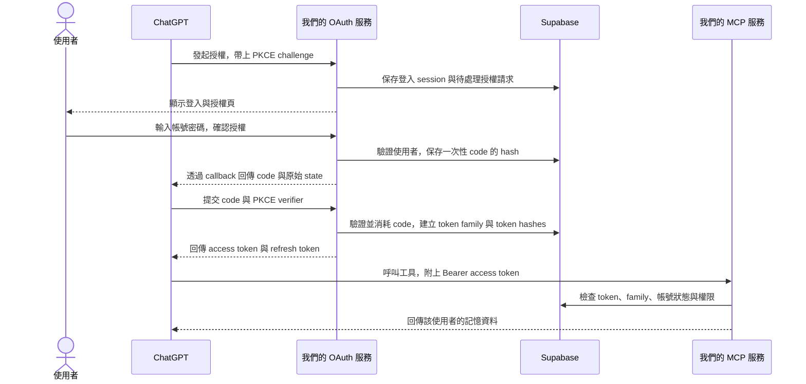
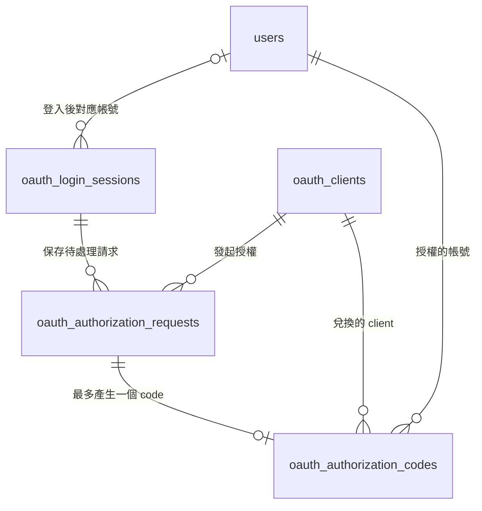
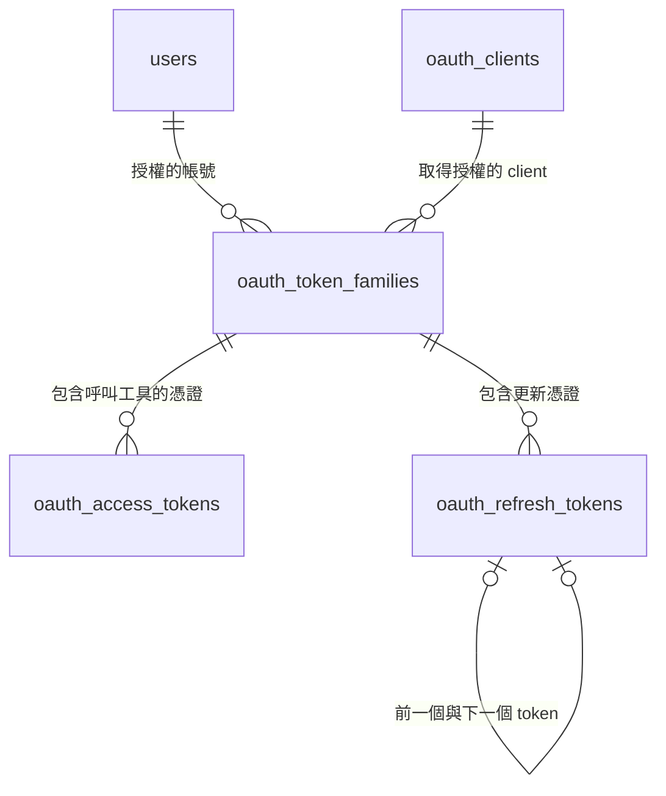
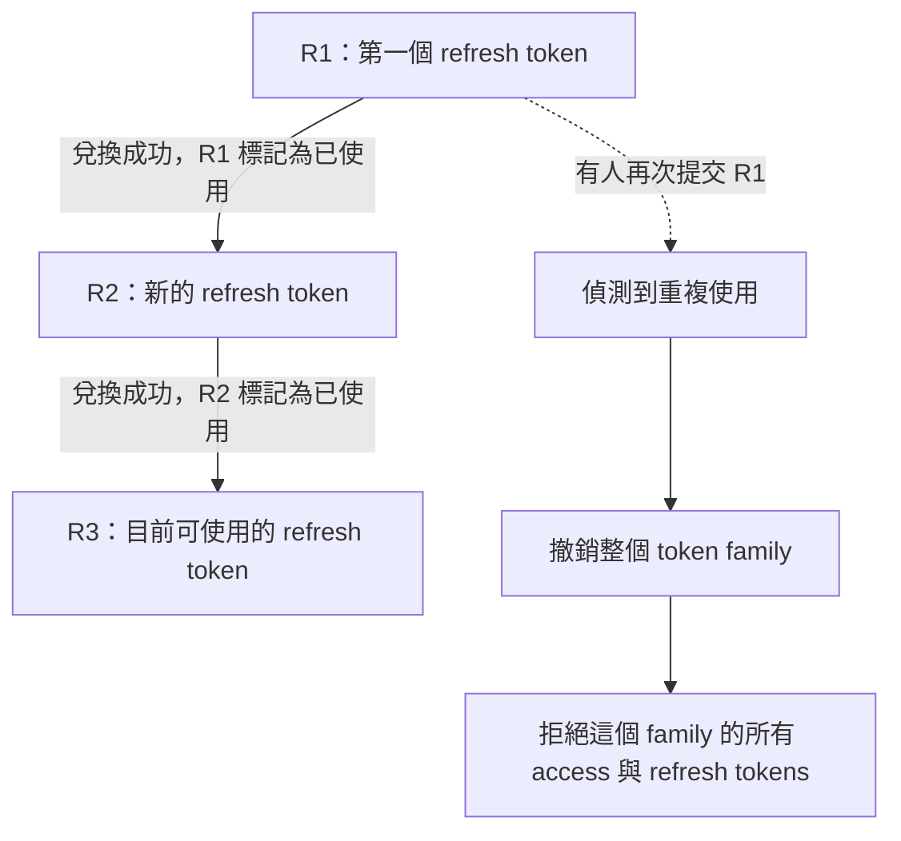

# OAuth 資料表與授權流程

這份文件說明「你登入自己的服務後，ChatGPT 如何取得存取記憶的權限」，以及每個步驟需要哪些資料表。

**資料表、discovery、client 註冊、登入授權、token 兌換、refresh rotation 與 MCP token 驗證均已完成。**

MCP 驗證與工具權限請見 [OAuth MCP 存取驗證](oauth-mcp-auth.md)。

連線設定與註冊端點請見 [OAuth discovery 與 client 註冊](oauth-discovery.md)。

登入、CSRF 與一次性 code 請見 [OAuth 登入與授權](oauth-login.md)。

Code 兌換與 refresh rotation 請見 [OAuth Token 兌換與更新](oauth-token.md)。

資料表定義：[003_oauth_storage.sql](../migrations/003_oauth_storage.sql)。帳號操作：[帳號管理 CLI](account-management.md)。

## 1. 一次完整連線會發生什麼事？

你用自己的帳號密碼登入我們的服務，再授權 ChatGPT 使用記憶功能。ChatGPT 取得 token；你的登入密碼由我們的服務驗證。



OAuth 與 MCP 可以運行在同一個服務中；圖中分開顯示，是為了區分「發行 token」與「驗證 token 後執行工具」兩種責任。

| 名稱 | 在這個專案中代表什麼？ |
| --- | --- |
| User | 你的服務帳號，例如 `admin`，保存在 `users` |
| Client | 代表使用者呼叫服務的應用程式，例如 ChatGPT；不是另一個使用者帳號 |
| Authorization code | 登入並同意授權後取得的一次性交換碼，用來兌換 token |
| Access token | 呼叫 MCP 工具時攜帶的憑證 |
| Refresh token | Access token 過期後，用來取得新 token 的憑證 |
| Token family | 同一次授權所衍生的整組 token，方便一起撤銷 |
| Resource / scopes | 授權給哪個服務，以及允許哪些操作 |

## 2. 登入到授權：前四張表

先保存「哪個 client 想取得什麼權限」，等使用者登入並同意後才建立 code。



圖中的「一對多」代表同一帳號或 client 可以有多次授權；一個待處理請求最多對應一個 code。

| 資料表 | 保存什麼？ | 為什麼需要？ |
| --- | --- | --- |
| `oauth_clients` | Client ID、名稱、允許的 redirect URIs、撤銷時間 | 辨識應用程式，提供 callback 網址的比對依據 |
| `oauth_login_sessions` | Session hash、使用者、期限 | 追蹤瀏覽器的短效登入狀態；登入前 `user_id` 可以是 `NULL` |
| `oauth_authorization_requests` | Session、client、callback、resource、scopes、state、PKCE challenge | 在使用者操作登入頁期間，保存授權的原始要求 |
| `oauth_authorization_codes` | Code hash、授權請求、使用者、client、授權參數、期限、使用時間 | 讓 ChatGPT 以一次性 code 兌換 token |

`oauth_login_sessions.csrf_token_hash` 是舊版相容欄位。Phase 8 起不再讀取，新 session 允許留空；待完成安全滾動部署後才能另行移除。

`state` 是 client 傳入、需要原樣帶回 callback 的值。`code_challenge` 是 PKCE 的驗證依據；原始 `code_verifier` 不儲存在資料庫。

第一版 client 僅支援 `token_endpoint_auth_method = 'none'`，表示兌換時不使用 client secret；後續仍必須驗證 code、client、redirect URI 與 PKCE。

## 3. 取得授權之後：後三張表

Code 兌換成功後，服務會建立 token family。這個 family 保存授權對象與範圍，並統一管理後續產生的 tokens。



| 資料表 | 保存什麼？ | 主要用途 |
| --- | --- | --- |
| `oauth_token_families` | User、client、resource、scopes、期限、撤銷時間 | 表示一次授權；撤銷時讓整組 token 失效 |
| `oauth_access_tokens` | Token hash、family、user、client、resource、scopes、期限、撤銷時間 | 每次呼叫 MCP 時查找並驗證 |
| `oauth_refresh_tokens` | Token hash、family、前一個 token hash、期限、使用及撤銷時間 | 更新 token，並追蹤舊憑證是否被再次使用 |

Access token 的 user、client、resource 必須與 family 相同，資料庫會透過外鍵強制檢查。Scopes 不得超出 family 的授權範圍，這部分由後續服務程式檢查。

即使某次授權沒有發行 refresh token，也可以建立 family 管理 access tokens。

## 4. Refresh token 如何輪替與撤銷？

每次成功更新，都會把舊 refresh token 標記為已使用，再發行下一個。下圖的 R1、R2、R3 都屬於同一個 family。



資料庫已限制「每個 family 最多一個初始 refresh token」及「每個 refresh token 最多一個後繼 token」，並確保前後兩個 token 屬於同一個 family。

輪替與重複使用偵測已完成。服務會在交易中鎖定記錄、更新 `consumed_at`，並建立下一個 refresh token。偵測到重放時會撤銷整個 family；MCP 驗證 access token 時也會檢查 family 的 `revoked_at`。

## 5. 哪些資料保存 hash？

| 資料 | 儲存方式 | 原因 |
| --- | --- | --- |
| 使用者密碼 | `users.password_hash` 保存 Argon2id hash | 保護人類設定的密碼 |
| Session ID、CSRF token、授權請求識別值 | 保存 SHA-256 hash | 避免直接保存可用的隨機憑證 |
| Authorization code、access token、refresh token | 保存 SHA-256 hash | 收到原始值後，先計算 hash 再查找記錄 |
| PKCE verifier | 不保存 | 兌換 code 時用它計算並比對 challenge |
| PKCE challenge、state、callback、resource、scopes | 保存原值 | 用於核對授權要求及回傳 callback |

SHA-256 hash 欄位限制為 64 個小寫十六進位字元。這只能驗證格式；應用程式仍須確實產生安全亂數並計算 hash。

## 6. 資料庫已保證什麼？服務還要做什麼？

| 已由 Phase 3 資料庫保證 | 後續 OAuth／MCP 服務必須實作 |
| --- | --- |
| Hash 格式、PKCE challenge 格式及 `S256` 方法 | 產生安全亂數、計算 hash、驗證 PKCE |
| 外鍵關聯、每個請求最多一個 code | 核對登入身分，將授權請求的參數正確綁定至 code |
| Token family 關聯與 refresh 輪替的唯一性 | 在交易中鎖定、兌換、標記已使用及偵測重複使用 |
| `expires_at` 必須晚於 `created_at` | 每次操作時確認尚未過期、尚未撤銷 |
| 保存 user、client、resource 與 scopes | 檢查帳號啟用狀態、client 撤銷狀態、resource 與操作權限 |
| 保存 session 與 CSRF token hash | Phase 5 已驗證表單 CSRF，並在登入成功時輪替 session secret |

七張表均啟用 Row Level Security（RLS），沒有公開存取 policy，並撤銷 `PUBLIC`、Supabase `anon` 與 `authenticated` 的資料表權限。後端透過具有適當權限的 `DATABASE_URL` 存取。

## 7. 清理資料與驗證方式

舊 refresh token 記錄需要保留至 family 已無法使用，才能偵測重複使用。外鍵沒有設定 cascade，刪除時須先處理引用其他記錄的資料。

建議清理順序：access tokens → refresh tokens（由最新往最舊）→ families → codes → 待處理請求 → sessions → clients／users。只能清理已不再需要的記錄；資料庫不會自動執行這些操作。

整合測試使用 `MEMORY_TEST_DATABASE_URL` 指定測試連線，再執行：

```bash
uv run pytest tests/test_oauth_storage.py
```

測試在獨立 schema 驗證 migration 可重跑、RLS 與 API 權限、token 關聯、輪替唯一性及格式約束，結束後回滾整個 schema 與測試資料。未設定測試連線時，會略過這三個測試。
