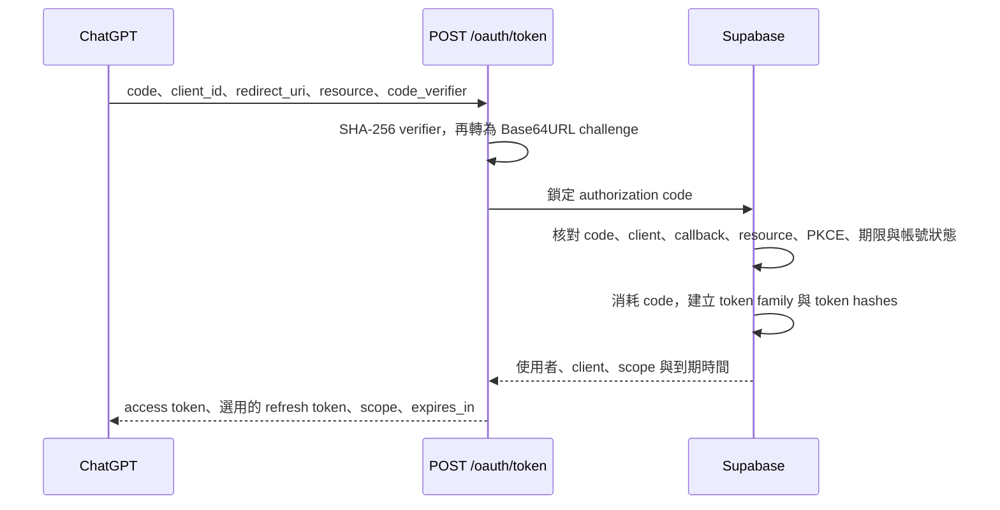
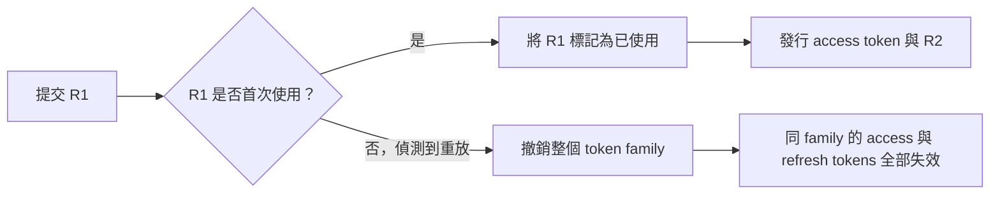

# OAuth Token 兌換與更新

Phase 6 已提供 `POST /oauth/token`，支援 public client 使用 authorization code + PKCE 取得 access token，以及使用 refresh token 更新憑證。這使 Phase 4 至 Phase 7 組成一條完整的 OAuth 連線流程。

依照 [OpenAI 官方 OAuth 文件](https://developers.openai.com/zh-Hant/plugins/build/auth)，ChatGPT 會使用 PKCE S256 兌換 authorization code，並在授權與 Token 請求中原樣傳遞 `resource`。本服務會重新核對這些資料，而不只相信瀏覽器授權階段的結果。

## Authorization code 兌換

請求使用 `application/x-www-form-urlencoded`：

| 欄位 | 規則 |
| --- | --- |
| `grant_type` | 必須是 `authorization_code` |
| `code` | Phase 5 回傳的一次性 code |
| `client_id` | 必須與授權 code 綁定的 public client 完全一致 |
| `redirect_uri` | 必須與原始授權請求完全一致 |
| `resource` | 必須與原始授權及目前 MCP resource 完全一致 |
| `code_verifier` | 43 至 128 字元，只接受 RFC 7636 的 unreserved characters |

成功後，access token 有效期最長一小時；token family 有效期 30 天。只有 client 註冊了 `refresh_token` grant 時才會回傳 refresh token。原始 code 與 tokens 都不寫入資料庫，只保存 SHA-256 hash。

## Refresh token rotation

更新請求包含 `grant_type=refresh_token`、`refresh_token`、`client_id` 與 `resource`。可選的 `scope` 只能縮小原始授權範圍，不能增加權限。每次成功更新都會回傳新的 refresh token；舊 token 立即標記為已使用。

若已使用的 refresh token 再次出現，服務會把這次情況視為憑證可能外洩，並在同一筆資料庫交易中撤銷整個 family。即使舊 access token 尚未到期，Phase 7 的每次請求驗證也會因 family 已撤銷而拒絕它。

## 錯誤與安全限制

| 錯誤 | 使用時機 |
| --- | --- |
| `invalid_request` | 缺少欄位、重複欄位或錯誤 Content-Type |
| `invalid_client` | 提交 client secret、client assertion 或 HTTP Authorization |
| `invalid_grant` | Code、PKCE、refresh token、callback、client 或 resource 不符，或憑證已過期／使用／撤銷 |
| `invalid_scope` | Refresh 要求超出原始授權範圍 |
| `unsupported_grant_type` | 不是 authorization code 或 refresh token grant |
| `temporarily_unavailable` | 資料庫暫時無法使用 |

所有回應都帶有 `Cache-Control: no-store` 與 `Pragma: no-cache`。請求 body 上限為 16 KiB；每個服務程序每分鐘最多處理 120 次嘗試。多程序部署仍應由入口服務提供共用流量限制。

目前只支援 public client 的 `token_endpoint_auth_method=none`，不接受 client secret。Token 端點的查詢、一次性消耗與 token 建立會在同一筆 PostgreSQL 交易內完成。

依 OAuth 規格，Token 請求中未識別的擴充參數會被忽略；已知但不支援的 client authentication 欄位仍會被拒絕。伺服器只會在日誌中記錄安全的拒絕原因，不會記錄授權碼、Token、PKCE verifier 或使用者憑證。
